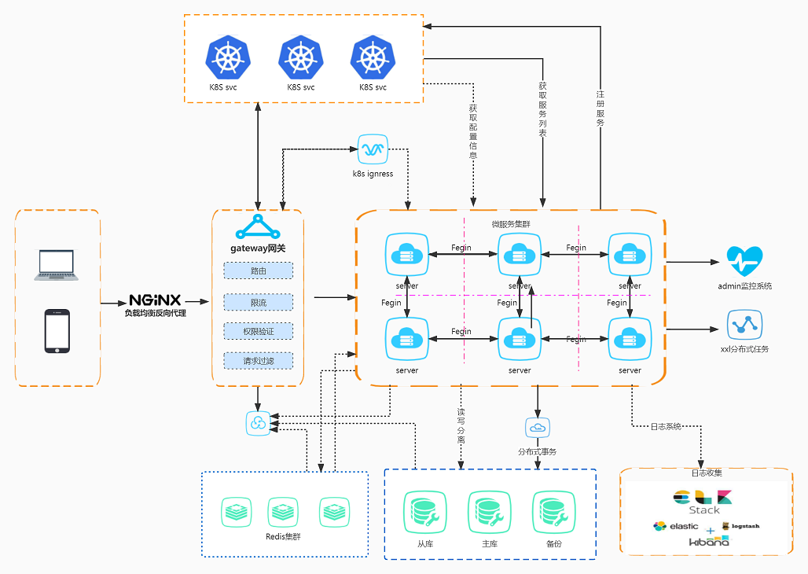

## COMMON-BACKEND-CLOUD


### 核心依赖
- 开发框架：Spring Boot 2.5.7
- 微服务框架：Spring Cloud 2021
- 安全框架：Spring Security + Spring OAuth 2.0
- 分布式任务调度：XXL-JOB
- 数据库支持: MySQL
- 持久层框架：MyBatis Plus
- 消息中间件：Redis、RabbitMQ
- 数据库连接池：Druid
- 服务注册与发现: k8s svc
- 客户端负载均衡：k8s svc
- 网关组件：Spring Cloud Gateway
- 日志管理：Logback
- 分布式事务：Seata
- 分布式锁：Redisson

### 系统架构图


### 模块说明

```lua
common-backend-cloud
├── common-component -- 系统公共模块
     ├── common-auth -- 授权
     ├── common-core -- 公共工具类核心包
     ├── common-feign -- 服务间远程调用
     ├── common-db -- 动态数据源包
     ├── common-log -- 日志模块
     ├── common-mybatis -- mybatis 扩展封装
     ├── common-rabbitmq -- rabbitmq 扩展封装
     ├── common-redis -- redis 扩展封装
     ├── common-swagger -- 接口文档
├── common-gateway -- 网关服务[8000]
├── common-visual -- 网关服务
     └── common-xxl-job-admim -- 分布式定时任务管理台 [5004]
     └── common-monitor -- 服务监控
     └── common-sentinel-dashboard -- 流量高可用
└── backstage-center -- 运维后台
     └── backstage-api -- 运维后台api模块
     └── backstage-svc -- 后台系统业务处理模块[8001]
└── user-center
     └── user-api -- 用户服务api模块
     └── user-svc -- 用户服务业务处理模块[8002]
└── code-generator -- 代码生成（不想要了，去github随便找个）
└── script 脚本
     └── sql -- sql脚本
     └── kubermetes -- yaml
```

### xxl-job-admin
```markdown
#### 默认用户
admin   123456


```

## 推送命令
```shell
mvn clean install org.apache.maven.plugins:maven-deploy-plugin:2.8:deploy -DskipTests


mvn clean install org.apache.maven.plugins:maven-deploy-plugin:2.8:deploy -DskipTests

```

